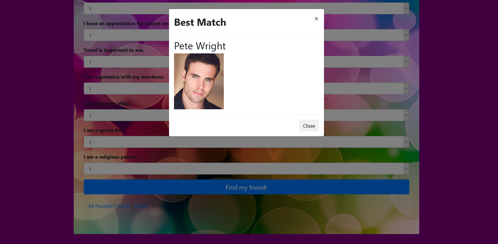

# Friend Finder

## Contributors
- kd101jp14

## Live Demo
[Friend Finder Application](https://immense-oasis-73958.herokuapp.com/)

## About
Friend Finder is an application that allows users to answer 10 questions and get matched up with a friend based on similar answers. This application includes a created server, html pages, and data. Other than the server, the key to this application is that it provides the user with the ability to create and receive data. 

## The Challenge
The main challenge of this project was calaculating the differences between the user's scores and each possible friend's scores. This issue was overcome by creating logic in the user's POST request. I used the .map and .reduce methods in order to help make this task easier to handle.

## How to use this application
Visit https://immense-oasis-73958.herokuapp.com/ and enjoy!

## Technologies Used
- Node.js
- Express
- Body-parser
- Javascript
- HTML
- CSS
- Bootstrap

## Preview

## License

This project does not have a license and is not currently open for contributions. Suggestions are welcome.

## Contact
- davis.kyra@rocketmail.com
